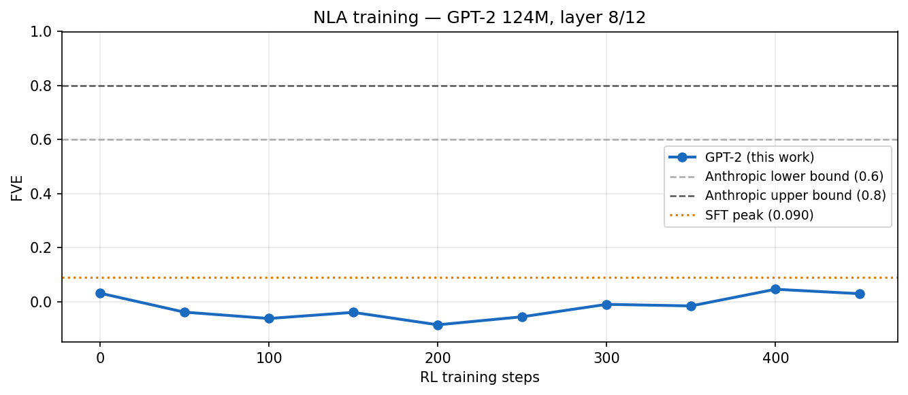

**Natural Language Autoencoder on GPT-2**

**Overview**

This project reimplements the core ideas from Anthropic's 2026 paper:

Natural Language Autoencoders Produce Unsupervised Explanations of LLM Activations

The goal is to investigate whether internal neural activations can be compressed into natural language explanations and then reconstructed back into activation space.

The original paper demonstrates this approach on Claude models, reporting Fraction of Variance Explained (FVE) values between 0.6 and 0.8. My objective was not to reproduce those exact numbers, but to reproduce the methodology on a much smaller open-source model under realistic compute constraints and analyze what works, what fails, and why.

**Why This Approach Matters**
Mechanistic interpretability often relies on analyzing neurons, features, or circuits directly.

**Natural Language Autoencoders (NLAs) propose a different approach:**

Convert an activation into a natural language explanation.
Reconstruct the activation from that explanation.
Measure how much information survives the natural-language bottleneck.

If reconstruction quality remains high, then natural language explanations contain meaningful information about the model's internal state.

This provides a scalable way to study representations without manually labeling features.

**Model Selection**
I chose GPT-2 (124M parameters) as the target model.

**Reasons:**

Runs comfortably on a free Kaggle T4 GPU.
Widely studied and easy to instrument.
Small enough for rapid experimentation.
Provides a realistic setting for testing whether the NLA methodology scales down.

**Target activation layer:**

Layer 8 of 12
Approximately 67% depth through the network

This roughly matches the middle-to-late layer region studied in the paper.

**Reimplementation**

The Natural Language Autoencoder consists of two components.

**Activation Verbalizer (AV)**

Input: residual stream activation vector

Output: natural language explanation

**Implementation:**

GPT-2 language model
Learned linear projection: R⁷⁶⁸ → R⁷⁶⁸
Activation injected into embedding space
Autoregressive generation

The AV attempts to translate activations into text.

**Activation Reconstructor (AR)**

Input: generated explanation

Output: reconstructed activation

The paper uses a language model as the reconstructor.

Running two GPT-2 models simultaneously exceeded available GPU memory, so I replaced the reconstructor with a smaller network:

EmbeddingBag
→ Linear(128 → 1024)
→ 4 Residual Blocks
→ LayerNorm
→ GELU
→ Linear(1024 → 768)

This is the main architectural deviation from the paper.

I expect this simplification to be the dominant reason for lower reconstruction quality compared with the Claude-scale results.

**Dataset**
Source: WikiText-103

**Processing:**
60,000 text samples
GPT-2 activations extracted from layer 8
5,000 proxy summaries generated for initialization

The activations serve as training targets for the autoencoder.

**Training Procedure**

Direct end-to-end training proved unstable.

Joint training from random initialization consistently failed, so I adopted a staged training procedure.

**Phase A — Reconstructor Warmup**
300 steps

**Objective:**
Train AR alone so reconstructed vectors have realistic magnitude.

**Observation:**
Without this phase, AR outputs remained close to zero and subsequent training collapsed.

**Phase B — Matched Pair Training**
800 steps

**Objective:**
Train AR on activation-summary pairs.

**Result:**
First stable positive FVE values appeared during this phase.
Peak FVE:≈ 0.09

**Phase C — Joint Supervised Fine-Tuning**
600 steps

**Objective:**
Train AV and AR jointly.

**Result:**
The verbalizer learned to generate fluent explanations, but reconstruction quality decreased relative to the best Phase B checkpoint.

Reward-Weighted Optimization

500 steps

Inspired by GRPO-style optimization.

**Procedure:**

Generate multiple candidate explanations.
Score each candidate using reconstruction error.
Compute relative advantages.
Update the verbalizer toward higher-reward explanations.

**Reward:**

r = −log(||h − AR(AV(h))||²)

This is not a full implementation of GRPO, but follows the same intuition of optimizing explanations according to reconstruction quality.

**Results**

### Fraction of Variance Explained (FVE)

| Stage                           | FVE       |
|---------------------------------|-----------|
| Phase B peak                    | ~0.09     |
| Phase C                         | 0.014     |
| Initial run                     | 0.0455    |
| Independent reproducibility run | 0.0913    |
| Anthropic paper                 | 0.60–0.80 |

The initial experiment achieved FVE = 0.0455.

To verify reproducibility, I reran the complete pipeline from scratch
on a separate Kaggle environment. The second run achieved
FVE = 0.0913.

The variation between runs reflects the instability of small-scale
joint optimization and reinforcement-style training, which was one of
the recurring observations throughout this project.

This is substantially below the paper's results but demonstrates a functioning natural-language bottleneck on a small model.

**Training Curve**

**The curve shows:**

Early reconstruction learning
Instability during joint training
Partial recovery during reward-weighted optimization
Qualitative Analysis

Generated explanations were usually grammatical and coherent.

However, they frequently failed to reflect the source content.

**Examples:**

Input Topic	Generated Explanation
France and Paris	Description of cities in Croatia
Mitochondria	Historical discussion of ships
Neil Armstrong	Discussion of universities
Fibonacci code	Discussion of astrophysics

These outputs suggest that GPT-2's language prior dominates the activation-conditioning signal.

The model learns to generate plausible WikiText-style prose but not reliably activation-specific explanations.

Steganography Experiment

The paper investigates whether reconstruction relies on semantic meaning or hidden token-level encoding.

I performed a simplified version of this test.

**Method:**

Generate explanation.
Paraphrase explanation.
Reconstruct activations.
Compare reconstruction error.

**Results**:

Condition	MSE
Original explanation	9.71
Paraphrased explanation	9.68
Ratio	0.997

A ratio near 1.0 suggests that reconstruction quality is largely preserved under paraphrasing.

This indicates that reconstruction is not relying exclusively on exact token sequences.

However, because overall FVE remains low, this result should be interpreted cautiously.

**Most Interesting Findings**

1. Reconstructor pretraining was essential
Every attempt at fully joint training failed.
The reconstructor needed to learn the activation space before the verbalizer could learn useful explanations.
This emerged from experimentation rather than from the paper.

2. Activation normalization produced unstable FVE estimates
The paper normalizes activations before injection into the verbalizer.
In my GPT-2 experiments, unit-normalized activations produced extremely small total variance, which made FVE highly unstable and often strongly negative.

**Using raw activations yielded stable measurements:**

Baseline MSE ≈ 9.7
Mean activation norm ≈ 110

Whether this behavior is specific to GPT-2 or generalizes to larger models remains unclear.

3. Fluent text does not imply meaningful explanations
The verbalizer quickly learned to generate realistic encyclopedia-style prose.
Yet qualitative inspection showed weak alignment with source content.
This suggests that producing fluent language is easier than producing informative explanations.

**Limitations**
The largest limitations are:

MLP reconstructor instead of a language-model reconstructor.
GPT-2 scale (124M) versus Claude-scale models.
Small training budget (~2200 optimization steps).
Proxy summaries rather than high-quality explanation supervision.

These factors likely explain most of the gap between 0.0455 FVE and the paper's reported 0.6–0.8.

**Reproducibility**

All experiments were run on:

Kaggle T4 GPU
15.6 GB VRAM
No API keys required

### Public Reproducibility Notebook

A complete independent rerun of the pipeline is available on Kaggle:

https://www.kaggle.com/code/elakkiya3/nla-gpt2-reproducibility-run-best-fve-0-0913

This notebook reproduces:

- Data preparation
- Activation extraction
- Phase A training
- Phase B training
- Joint SFT
- Reward-weighted optimization
- FVE evaluation
- Figure generation

The run achieved Best FVE = 0.0913.

**Repository structure:**

src/
├── config.py
├── data.py
├── models.py
├── train.py
└── evaluate.py

figures/
└── fve_curve.png

data/
└── qualitative_results.json

**To reproduce:**

git clone https://github.com/Elakkiya3/nla-gpt2

cd nla-gpt2

pip install -r requirements.txt

The complete experiment was executed through a Kaggle notebook on a
T4 GPU.

Open the public notebook and run all cells in order:

https://www.kaggle.com/code/elakkiya3/nla-gpt2-reproducibility-run-best-fve-0-0913

This notebook reproduces:

- Data preparation
- Activation extraction
- Phase A training
- Phase B training
- Joint SFT
- Reward-weighted optimization
- FVE evaluation
- Figure generation

The run achieved Best FVE = 0.0913.

**Conclusion**

This project successfully reproduces the core Natural Language Autoencoder framework on a small open-source language model.

Although reconstruction performance remains far below the Claude-scale results reported by Anthropic, the experiments revealed several useful findings:

Reconstructor pretraining is critical.
Activation normalization can destabilize FVE at small scale.
Fluent explanations are easier to learn than informative explanations.
Reward-weighted optimization partially recovers reconstruction quality after joint training.

The main takeaway is that the Natural Language Autoencoder methodology
remains viable at GPT-2 scale, but reconstruction capacity and training
stability appear to be the dominant bottlenecks.

Across independent runs, the system achieved FVE values between
0.0455 and 0.0913, suggesting that meaningful information can survive
the natural-language bottleneck even under severe compute constraints.

**Reference**

Fraser-Taliente, Kantamneni, Ong et al. (2026)

Natural Language Autoencoders Produce Unsupervised Explanations of LLM Activations

https://transformer-circuits.pub/2026/nla/index.html
